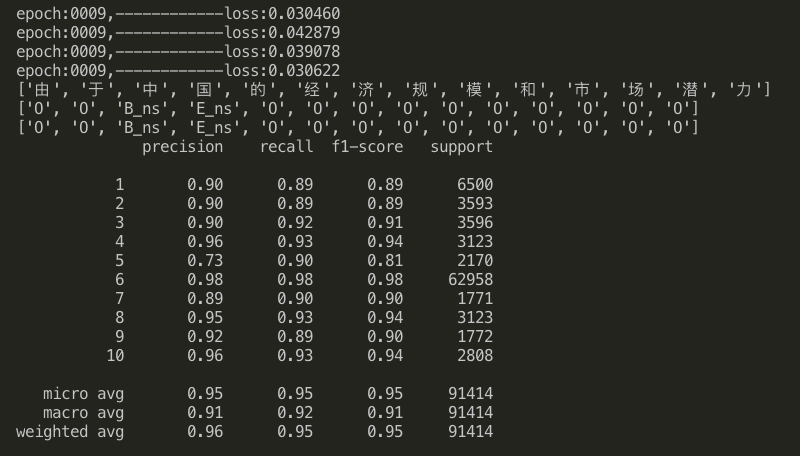
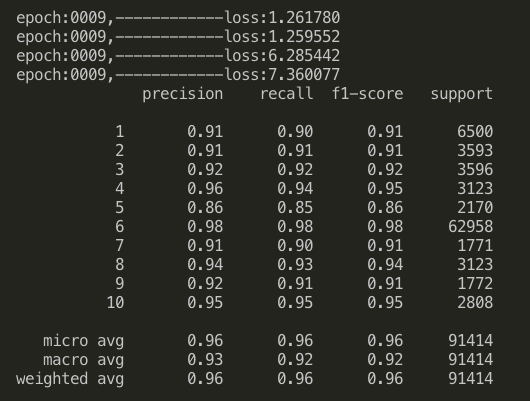

# NER
## pytorch版的命名实体识别，LSTM 和 LSTM_CRF 结果对比
## pytorch 官方CRF只能一条一条的样本进行解码，太慢了，该repo使用了基于AllenNLP实现的CRF包，速度可以保证。

## 数据集
> 人民日报中文数据集，data目录下，人名、地名、机构名三种实体的识别，TAG如下：
```
M_nt     1
E_ns     2
B_ns     3
B_nr     4
M_ns     5
O        6
E_nt     7
E_nr     8
B_nt     9
M_nr    10
```

### requirements.txt
1. pytorch
2. pytorch-crf
3. sklearn

## 运行
1. 在data目录下运行  
    + python data_renmin_word.py
2. config.py 文件修改model参数，可选 NERLSTM 和 NERLSTM_CRF
3. 运行 main.py  
    + python main.py

## 结果
## LSTM



## LSTM_CRF




## 结论

> **加CRF层不管在 micro_avg 还是 在 macro_avg 上平均有一个点的提升**
