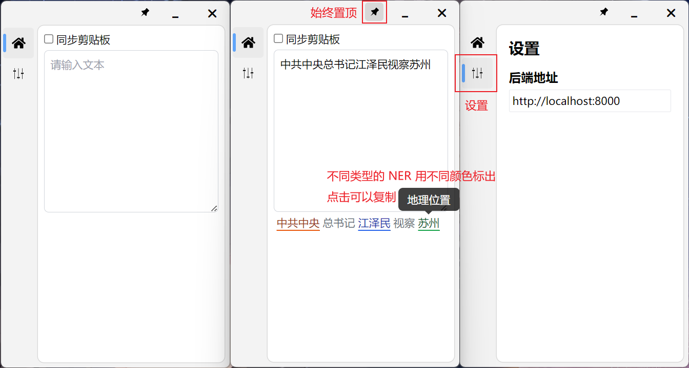
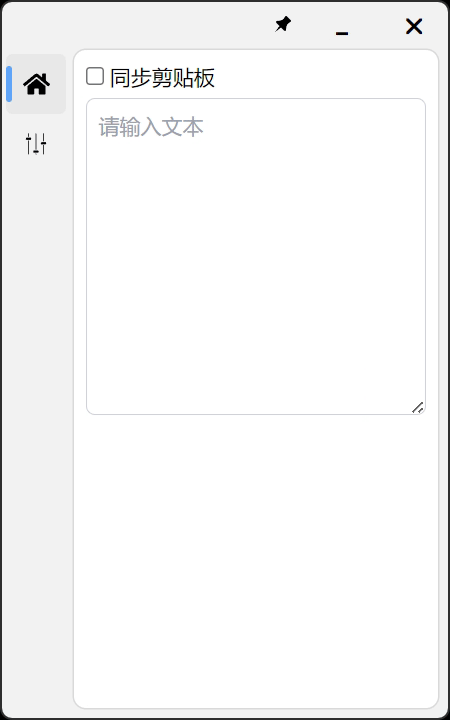

# 课程设计

说是课设，实际上就是实验课从头做到尾的大作业。单人作业。

有几个题目可选，分词、命名实体识别（NER）、翻译、情感分析，都是深度学习的东西，还有其他什么题目我记不清了。实际上最后大家基本都做的 NER 或情感分析，因为比较简单，而且给的代码资料比较全（我做的 NER）。

每个选题都会给能够运行的代码，其实就是几个助教帮忙在 GitHub 上找到的然后确认能跑通的代码，同学们把代码跑通，看懂代码，改点参数调一调，然后再写份实验报告其实就差不多了，比如写一写代码的逻辑结构，画几个图表，给出不同参数下的实验结果之类的。没要求从零开始写代码，毕竟大家也没学过深度学习的东西。

大概也是觉得这个要求太简单了，除了要求调调参写好实验报告，还要求做个简单的 UI 界面作为 Demo，不管你用 Qt 还是 Web 写都行，也不算复杂。最后需要把这些东西都写到实验报告里去。

我自己这个最后的 App Demo 是前后端分离做的，后端（`fastapi-ner-app`）用的 Python 的 FastAPI，传到这个仓库之前我跑了一下，确定可以跑通，并且把代码改得比较规范了；客户端（`svelte-ner-app`）使用 Tauri 做的，实际上还是 Web 那一套技术，前端用的 Svelte 框架，当时主要是尝个鲜，后来发现 Svelte 果然不好用。客户端有编译出 Windows 的可执行文件，即 `svelte-ner-client/ner-demo-client.exe`，如果你用 macOS 或 Linux 就自己跑一遍代码吧，代码跑起来不复杂，但 Tauri 毕竟用的 Rust，编译速度非常感人。

记得跑客户端的时候把后端启动了，客户端依赖于后端运行。

训练的代码在 `NERLSTM` 里，助教找的，来自[这个仓库](https://github.com/hackerxiaobai/NER)。原仓库的代码可能是由于 Python 版本问题，我一开始没跑通，稍微改了点代码，已经忘了改了啥代码了。`NERLSTM/` 文件夹里的 `README.md` 是原仓库的 README，我一个字没改。

实验报告也放在这里了，还有几个开题汇报和中期汇报的 PPT.

我个人做出来最终效果大致这样：

然后关于模型调参训练部分，做了几张图，用 ECharts 画的（ECharts 有[在线示例](https://echarts.apache.org/examples/zh/index.html)，调一下数据就可以直接下载图表，其实挺方便的）。这里展示一张示例，具体看实验报告：

