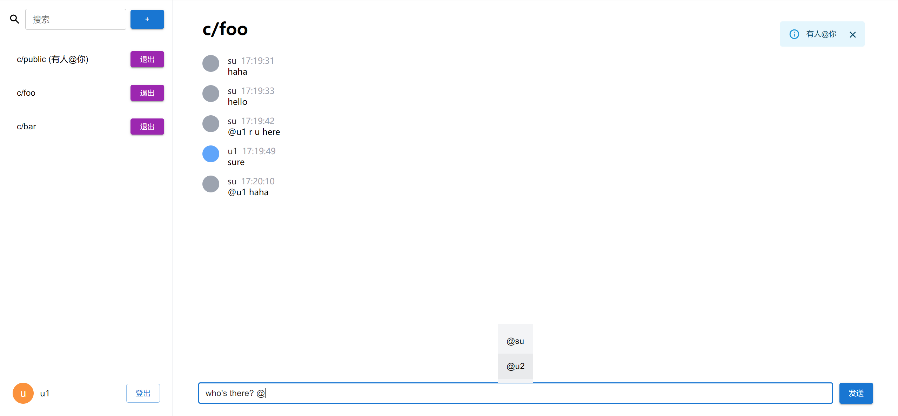

# react-chatroom-app

聊天室前端，使用 React + MUI + Tailwind CSS 开发，使用 Vite 作为构建工具。

支持加入和创建聊天室，聊天室内支持实时通信，支持 `@` 提及用户——如果在当前聊天室内被 `@` 到，会在右上角弹出提醒，否则会在聊天室标题上显示提醒。



后端是 `nestjs-chatroom-app`，启用前端时确保后端服务已启动。

架构和 [react-lottery-app](../../lottery/react-lottery-app/README.md) 基本一致，前端用的 GraphQL 客户端还是我自己搓的轮子 graphql-intuitive-request. 聊天室的实时通信采用 GraphQL Subscriptions 实现。

有三个用户，用户名分别是 `su`、`u1` 和 `u2`，密码都是 `1234`.

## 软件架构

- 语言: TypeScript
- 主要使用框架: React
- UI 框架: MUI + Tailwind CSS
- 路由: React Router
- 请求: graphql-intuitive-request
- 构建工具: Vite
- 代码风格: TypeScript ESLint Recommended
- 其他: Prettier + ESLint

## 安装

确保你的电脑上已经安装了 Node.js 及 npm，然后进入本项目的根目录，运行以下命令即可。

```shell
npm install
```

## 启动

运行以下命令启动项目：

```shell
npm run dev
```
