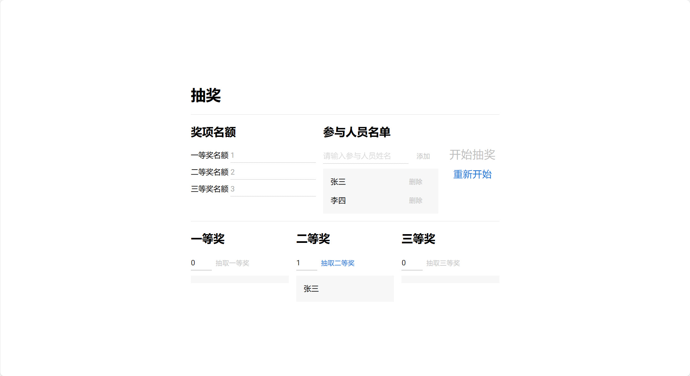

# react-lottery-app

抽奖程序前端，使用 React + MUI + Tailwind CSS 开发，使用 Vite 作为构建工具。

支持修改参与者、各个奖项开奖总人数、部分开奖。



后端是 `nestjs-lottery-app`，启用前端时确保后端服务已启动。

由于后端服务用的是 GraphQL，前端用的 GraphQL 客户端是 graphql-intuitive-request，我自己造的一个轮子。相关代码位于 `src/utils/client.ts` 中。

代码结构应该没啥好谈的，很容易看懂。一共就两个页面，登录页位于 `src/pages/login/index.tsx`，抽奖页位于 `src/pages/lottery/index.tsx`. 除此之外，在地址栏访问 `/logout` 可以直接退出登录。

登录用户名和密码分别是 `su` 和 `1234`.

## 软件架构

- 语言: TypeScript
- 主要使用框架: React
- UI 框架: MUI + Tailwind CSS
- 路由: React Router
- 请求: graphql-intuitive-request
- 构建工具: Vite
- 代码风格: TypeScript ESLint Recommended
- 其他: Prettier + ESLint

## 安装

确保你的电脑上已经安装了 Node.js 及 npm，然后进入本项目的根目录，运行以下命令即可。

```shell
npm install
```

## 启动

运行以下命令启动项目：

```shell
npm run dev
```
